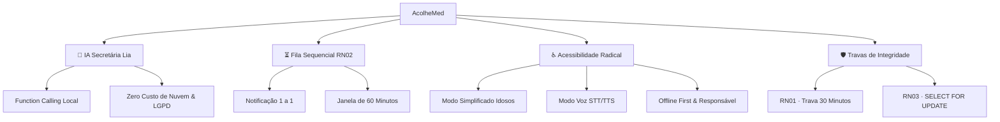

<div align="center">

# 🩺 AcolheMed

### **Sistema Inteligente e Inclusivo de Agendamento em Saúde**
*Secretária Virtual com IA Local · Fila de Espera Viva · Acessibilidade Radical · Gestão Integrada*

[](https://react.dev/)
[](https://www.typescriptlang.org/)
[](https://tailwindcss.com/)
[](https://vitejs.dev/)
[](https://kimi.moonshot.cn/)
[](https://www.w3.org/WAI/standards-guidelines/wcag/)

<br />

[**Explorar Demonstração**](#-roteiro-de-demonstração-ao-vivo) •
[**Pilares da Solução**](#-pilares-da-solução) •
[**Arquitetura**](#-arquitetura-e-fluxo-de-dados) •
[**Como Rodar**](#-como-rodar-o-projeto) •
[**Plano de Evolução**](./suggest.md)

</div>

---

## 📌 Visão Geral

O **AcolheMed** é uma plataforma moderna desenvolvida para resolver os maiores gargalos do atendimento ambulatorial e clínicas multiprofissionais:
- **Linhas telefônicas congestionadas** e sobrecarga das recepcionistas;
- **Altas taxas de absenteísmo (*no-show*)** que atingem até 30% nas clínicas populares;
- **Cancelamentos de última hora** que deixam horários médicos ociosos sem tempo hábil de remanejamento;
- **Exclusão digital de idosos e PcDs** devido a interfaces complexas e inacessíveis.

A plataforma integra uma **secretária virtual autônoma (Lia)** com *function calling*, **fila de espera sequencial em tempo real**, **modo de voz bidirecional** e painéis operacionais para médicos e administradores.

---

## 🌟 Pilares da Solução



### 1. 🤖 Secretária Virtual com IA (Lia)
- **Execução Determinística (*Function Calling*):** A IA não é apenas um chatbot conversacional; ela executa 10 ferramentas de backend diretamente no banco de dados (`agendar_consulta`, `cancelar_consulta`, `reagendar_consulta`, `confirmar_consulta`, `buscar_horarios`, `buscar_consulta`, `buscar_orientacoes`, `buscar_responsavel`, `inserir_fila_espera`, `consultar_fila`).
- **Privacidade Total & Eficiência (LGPD):** Integrada com IA (Kimi). Nenhum dado clínico ou sensível do paciente sai do controle da clínica.

### 2. ⏳ Fila de Espera Sequencial Inteligente (RN02)
- **Recuperação de Vagas:** Quando uma consulta é cancelada, o sistema notifica **apenas o 1º colocado** da fila de espera em vez de disparar mensagens em massa.
- **Janela de Decisão:** O paciente tem 60 minutos para confirmar ou recusar a vaga pelo aplicativo. Se expirar, a oportunidade é automaticamente repassada para o próximo da fila, mantendo a ocupação médica sempre otimizada.

### 3. ♿ Acessibilidade Radical & Inclusão
- **Modo Simplificado:** Interface com tipografia ampliada, botões com alvos de toque gigantes, alto contraste e fluxo reduzido, pensado especialmente para idosos.
- **Modo Voz Completo:** Operação 100% por voz utilizando a *Web Speech API* nativa (reconhecimento de fala e síntese de voz em português pt-BR), permitindo navegação completa para deficientes visuais.
- **Modo Offline Resiliente:** Cache inteligente de comprovantes, instruções de preparo de exames e contatos de emergência mesmo sem conexão com a internet.
- **Gestão de Dependentes/Responsável:** Permite que cuidadores e familiares acompanhem consultas com controle granular de permissões aprovadas pelo titular.

### 4. 🛡️ Regras de Negócio e Travas de Integridade
- **RN01 (Trava de 30 Minutos):** Cancelamentos e remarcações automáticas são permitidos até 30 minutos antes do horário agendado. Dentro da janela crítica, o app bloqueia e direciona para a recepção humana, protegendo a agenda médica.
- **RN03 (Prevenção de Concorrência Transacional):** Controle transacional equivalente a `SELECT ... FOR UPDATE`, garantindo que dois pacientes nunca reservem simultaneamente a mesma vaga.

---

## 📱 Telas e Módulos do Sistema

| Módulo / Perfil | Descrição & Funcionalidades |
|---|---|
| 📱 **App do Paciente** | Wizard intuitivo de agendamento por especialidade e médico, calendário visual com semáforo de ocupação, emissão de comprovantes com QR Code, orientações de exames e histórico. |
| 💬 **Central da IA (Lia)** | Console de atendimento inteligente com suporte a voz, atalhos contextuais rápidos e monitoramento em tempo real de chamadas de ferramentas (*tool calls*). |
| 🧑‍⚕️ **Painel do Médico** | Visualização diária e semanal de atendimentos, prontuário com evolução clínica editável e marcação rápida de status (Concluído / Não Compareceu). |
| 🏥 **Painel de Gestão** | Dashboard com taxas de ocupação, absenteísmo, simulador interativo de desistências da fila RN02, gestão de jornadas por médico e log de auditoria de ações. |
| 🎙️ **Laboratório de Acessibilidade** | Simuladores interativos do Modo Voz, Modo Offline inteligente e painel de permissões de responsáveis autorizados. |
| ⚙️ **Secretaria & Automação** | Confirmação automatizada de presença, bloqueio emergencial de agendas com notificação de pacientes impactados e checklist "O Que Levar". |

---

## 🛠️ Tecnologias Utilizadas

- **Frontend:** [React 18](https://react.dev/) + [TypeScript 5](https://www.typescriptlang.org/)
- **Estilização:** [Tailwind CSS v4](https://tailwindcss.com/) + Variáveis de Design Tokens personalizadas
- **Build & Dev:** [Vite 6](https://vitejs.dev/)
- **Animações & Interatividade:** [Framer Motion](https://www.framer.com/motion/) + Canvas Confetti
- **Ícones:** Ícones autorais em SVG customizados com traço adaptável
- **Voz & IA:** Web Speech API (STT/TTS) + Arquitetura de Tool Calling compatível com Kimi
- **Especificação de Backend:** Node.js · Express · MySQL 8 (com isolamento transacional `FOR UPDATE`)

---

## 🚀 Como Rodar o Projeto

### Pré-requisitos
- [Node.js](https://nodejs.org/) versão 18.0 ou superior
- Gerenciador de pacotes `npm` ou `yarn`

### Passo a passo

```bash
# 1. Clone o repositório
git clone https://github.com/GuiBazon/AcolheMed.git

# 2. Acesse a pasta do projeto
cd AcolheMed

# 3. Instale as dependências
npm install

# 4. Inicie o servidor de desenvolvimento
npm run dev
```

Abra seu navegador em [http://localhost:5173](http://localhost:5173) para explorar a aplicação.

### Scripts Disponíveis
- `npm run dev`: Inicia o ambiente de desenvolvimento com Hot Module Replacement.
- `npm run build`: Compila o projeto otimizado para produção na pasta `dist/`.
- `npm run typecheck`: Executa a checagem de tipos com o compilador TypeScript.

---

## 🧪 Roteiro de Demonstração ao Vivo

Para avaliar as principais funcionalidades em menos de 3 minutos:

1. **Agendamento por Conversa:** Clique no botão flutuante da Lia ou vá até a Central da IA e digite: *"Quero marcar cardiologia amanhã de manhã pelo convênio"*.
2. **Validação da Trava RN01:** No chat ou no app, tente cancelar a consulta de encaixe da Maria (marcada para os próximos minutos). O sistema barrará e fornecerá o contato da recepção.
3. **Fila Viva (RN02):** Na seção de Gestão, clique em **"Simular desistência"**. Observe a notificação no smartphone, o cronômetro da janela de 60s e confirme a vaga.
4. **Interação por Voz:** Na seção de Acessibilidade, ative o Modo Voz pelo microfone e pergunte: *"Qual minha próxima consulta?"* (recomendado Google Chrome).
5. **Modo Simplificado:** Na aba "Perfil" dentro do celular demonstrativo, ative o Modo Simplificado e veja a interface se reconfigurar.

---

## 📁 Estrutura de Diretórios

```
AcolheMed/
├── src/
│   ├── components/
│   │   ├── AcessibilidadeSection.tsx # Simuladores de Voz, Offline e Responsável
│   │   ├── AdminPanel.tsx            # Gestão da clínica e simulador da fila RN02
│   │   ├── AiConsole.tsx             # Central de IA com visualização de Tool Calls
│   │   ├── AutomacaoSection.tsx      # Confirmações, bloqueios e auditoria
│   │   ├── Chat.tsx                  # Mecanismo de NLP, IA, Parsers e 10 Tools
│   │   ├── DoctorPanel.tsx           # Agenda e prontuário médico
│   │   ├── FloatingLia.tsx           # Botão flutuante global da assistente
│   │   ├── Hero.tsx                  # Seção principal de apresentação com vitais
│   │   ├── PhoneApp.tsx              # Simulador do aplicativo mobile do paciente
│   │   ├── PitchSection.tsx          # Pitch comercial, schema SQL e especificações
│   │   ├── RulesSection.tsx          # Demonstração visual das regras RN01/RN02/RN03
│   │   ├── TopBar.tsx                # Cabeçalho de navegação responsivo
│   │   ├── icons.tsx                 # Ícones autorais em SVG
│   │   └── ui.tsx                    # Componentes utilitários de UI e animações
│   ├── data.ts                       # Schema de dados, médicos, jornadas e ocupação
│   ├── store.tsx                     # Gerenciamento de estado global e regras RN02
│   ├── index.css                     # Configurações de tema e estilos globais
│   ├── main.tsx                      # Ponto de entrada React
│   └── App.tsx                       # Estrutura principal da página
├── instrucoes.md                     # Guia rápido de testes e especificação das regras
├── suggest.md                        # Plano de evolução e arquitetura de produção (21 iniciativas)
└── package.json                      # Dependências e scripts do projeto
```

---

## 📄 Documentação Complementar

- 📖 [**Guia de Instruções & Testes**](./instrucoes.md): Detalhamento técnico de como cada fluxo e regra de negócio opera.
- 📋 [**Plano de Melhorias & Evolução**](./suggest.md): Planejamento detalhado com 21 iniciativas para transição para ambiente hospitalar/produção.

---

<div align="center">

**Projeto Integrador SENAI 2026** · *Protótipo Conceitual e Demonstrativo*

Desenvolvido com foco em **impacto social, acessibilidade e inovação em saúde pública e privada**.

</div>
