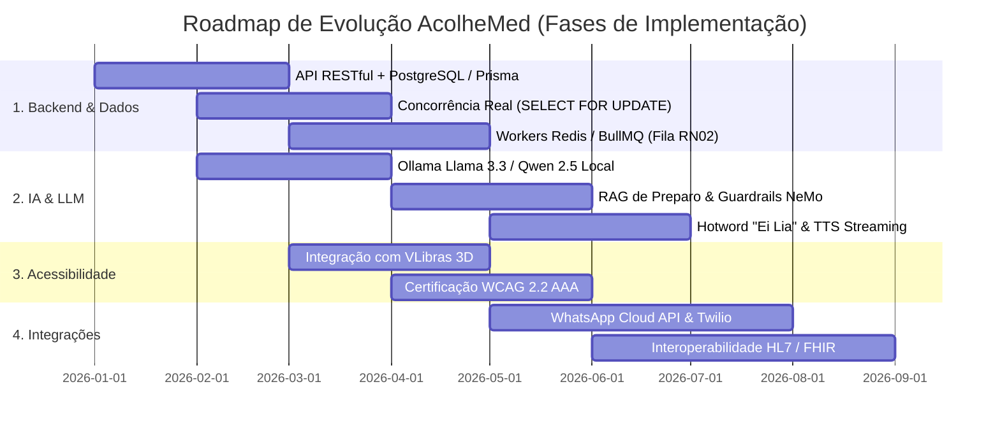

# 📋 Plano de Evolução, Arquitetura de Produção e Roadmap — AcolheMed

Este documento estabelece o plano de engenharia de software, segurança clínica e maturidade de produto com **21 iniciativas estratégicas** divididas em 6 frentes fundamentais para elevar o protótipo **AcolheMed** a um sistema hospitalar em escala de produção.

---

## 🗺️ Visão Geral do Roadmap

---

## 🏗️ 1. Arquitetura, Backend & Camada de Dados

### 🔹 1.1. Transição do Mock State para API RESTful / GraphQL
- [ ] **Arquitetura em Camadas (NestJS ou Fastify + TypeScript):**
  - Migrar a lógica contida em `store.tsx` e `Chat.tsx` para serviços desacoplados no backend (`SchedulingService`, `QueueService`, `PatientService`, `AuditService`).
  - Implementação de DTOs rigorosos validados via `Zod` / `class-validator`.
- [ ] **Banco de Dados Relacional com ORM (PostgreSQL 16 + Prisma / Drizzle):**
  - Implementar schema relacional com chaves estrangeiras, constraints e índices compostos em `(medico_id, data_hora)` e `(paciente_id, status)`.
- [ ] **Garantia de Concorrência Transacional Real (RN03):**
  - Implementação de nível de isolamento `REPEATABLE READ` / `SERIALIZABLE` ou queries explícitas com `SELECT ... FOR UPDATE` para assegurar que colisões simultâneas de horários sejam tratadas atomicamente.

### 🔹 1.2. Processamento Assíncrono e Mensageria (Redis + BullMQ)
- [ ] **Gerenciamento do Motor da Fila de Espera (RN02):**
  - Substituição dos timers de frontend por jobs assíncronos agendados no Redis com TTL exato de 60 minutos.
  - Repasse automatizado de notificação para o 2º colocado caso a janela do 1º colocado expire sem confirmação.
- [ ] **Disparador de Lembretes & Confirmação Ativa:**
  - Agendamento de cron jobs para envio de notificações 24h e 2h antes de cada consulta, solicitando confirmação de presença (redução de *no-show*).

### 🔹 1.3. Segurança, Autenticação e LGPD / HIPAA
- [ ] **Autenticação Segura & Biometria:**
  - Autenticação via JWT com Refresh Tokens em cookies `HttpOnly` seguros.
  - Suporte a WebAuthn / Passkeys para autenticação biométrica em dispositivos móveis.
- [ ] **Criptografia de Dados Sensíveis:**
  - Criptografia em repouso (AES-256) para prontuários, evoluções médicas e dados de identificação do paciente (LGPD Art. 13).
- [ ] **Controle de Acesso Baseado em Papéis (RBAC):**
  - Middleware de autorização para validar estritamente as permissões concedidas a dependentes/cuidadores antes de permitir ações de reagendamento ou cancelamento.

---

## 🤖 2. Inteligência Artificial & Agente de Voz (Lia)

### 🔹 2.1. Integração com LLM Local de Produção
- [ ] **Servidor de Inferência Local (Ollama / vLLM / llama.cpp):**
  - Conexão via endpoint interno com Llama 3.3 8B Instruct ou Qwen 2.5 7B, rodando com quantização (GGUF / AWQ) em GPU dedicada na clínica.
  - Schema de *Function Calling* padronizado para as 10 tools com validação estrita de tipos no retorno.
- [ ] **RAG (Retrieval-Augmented Generation) para Orientações Clínicas:**
  - Banco vetorial local (Qdrant / ChromaDB) indexando manuais de preparo de exames, especialidades, convênios atendidos e políticas internas da clínica.
- [ ] **Guardrails Médicos de Segurança (NeMo Guardrails):**
  - Filtros rígidos para impedir que o modelo forneça diagnósticos conclusivos, receite fármacos ou interprete exames, redirecionando urgências para o SAMU 192.

### 🔹 2.2. Aprimoramento da Experiência por Voz
- [ ] **Detecção de Palavra de Ativação (*Hotword Detection*):**
  - Ativação hands-free via modelo de wake-word leve ("Ei Lia"), permitindo início do atendimento sem necessidade de toque na tela.
- [ ] **Streaming de Áudio em Tempo Real:**
  - Síntese de fala por streaming via WebSocket com latência inferior a 350ms, proporcionando conversação natural e fluida.

---

## ♿ 3. Acessibilidade & Inclusão (WCAG 2.2 Nível AAA)

- [ ] **Integração com VLibras:**
  - Widget integrado com avatar 3D para tradução automática em tempo real para a Língua Brasileira de Sinais (Libras), garantindo acessibilidade para pacientes surdos.
- [ ] **Temas de Alto Contraste Personalizáveis:**
  - Modos Amarelo/Preto, Branco/Preto e Azul/Amarelo com contraste superior a 7:1 em todos os elementos interativos.
- [ ] **Navegação Integral por Teclado e Leitores de Tela:**
  - Compatibilidade e testes com NVDA, JAWS e VoiceOver, com landmarks semânticos e atributos `aria-live` em todas as alterações dinâmicas de estado.

---

## 📱 4. Aplicativo Mobile Nativo (React Native / Expo)

- [ ] **Migração do Simulador para App Nativo:**
  - Compilação do app para Android e iOS utilizando **Expo Application Services (EAS)** e React Native.
- [ ] **Notificações Push Nativas (FCM / APNs):**
  - Alertas prioritários para chamadas da fila RN02 e lembretes de consultas que despertam a tela do celular.
- [ ] **Sincronização com Calendário do Sistema:**
  - Integração com Google Calendar e Apple Calendar para adicionar a consulta confirmada à agenda pessoal com um clique.

---

## 🔗 5. Integrações com Ecossistemas de Saúde

- [ ] **Canal Oficial WhatsApp (WhatsApp Cloud API / Twilio):**
  - Permitir que a secretária Lia atenda os pacientes diretamente pelo WhatsApp oficial da clínica com o mesmo motor de *Tool Calling*.
- [ ] **Interoperabilidade com Padrões de Saúde (HL7 / FHIR):**
  - Exportação de dados de agendamento e evolução clínica nos padrões abertos de saúde digital para integração com PEPs de mercado (Tasy, MV, Pixeon).
- [ ] **Gateway de Pagamento Integrado:**
  - Checkout transparente via PIX com geração automática de QR Code dinâmico e conciliação bancária imediata para consultas particulares.

---

## 📊 6. Analytics & Inteligência Operacional

- [ ] **Predição de Absenteísmo (*No-Show Scoring*):**
  - Modelo preditivo de Machine Learning para identificar pacientes com alta probabilidade de falta e sugerir overbooking preventivo ou lembretes antecipados.
- [ ] **Painel de Otimização de Produtividade Médica:**
  - Relatórios de tempo médio de consulta, taxa de ocupação real vs. prevista e tempo de resposta da fila de espera sequencial.
- [ ] **Trilha de Auditoria Imutável:**
  - Logs detalhados de todas as ações de agendamento, cancelamento e acesso a dados para conformidade com normas do Conselho Federal de Medicina (CFM).

---

**AcolheMed** · *Transformando o acesso à saúde com tecnologia inclusiva e responsável.*

